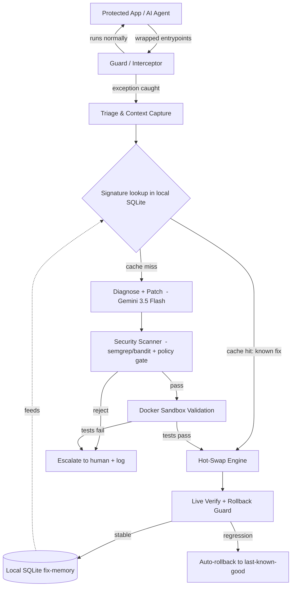

# OmniForge — Architecture & Build Spec

**The Self-Healing Proxy: autonomous runtime debugging, patching, and hot-swapping for production AI systems.**

> Hackathon: AI Engineer World's Fair Hackathon 2026 · Theme: **The Self-Improvement Stack** (+ Recursive Intelligence & Continual Learning) · Stack: **DigitalOcean + Gemini 3.5 Flash** (only)

This document is the build spec. Hand it to Claude Code section by section. Phases are ordered so you have a working end-to-end loop early and de-risk the demo.

---

## 0. One-paragraph mental model

OmniForge supervises a running AI app. When the app throws an unhandled error (vendor API changed its schema, a dependency bumped, an edge-case input), OmniForge catches it *before it crashes the process*, asks Gemini 3.5 Flash to write a patch, runs that patch through a **security scanner** and an **isolated Docker sandbox**, and—only if it passes—**hot-swaps** the fixed code into the live process. Every validated fix is stored in a **local SQLite database on the droplet**, keyed by a normalized error signature, so the *next* occurrence of the same error is fixed instantly from memory without calling the model. The more it runs, the faster and cheaper it heals.

There is **no dashboard as a primary surface** (per the banned-projects rule). The product *is* the autonomous loop.

---

## 1. System overview



**Latency budget (cache miss):** Gemini patch ~1–2s, security scan <1s, sandbox replay + tests ~3–6s, hot-swap <1s → **under ~10s**. Cache hit: **<1s** (no model call).

Everything runs on **one DigitalOcean droplet**: the proxy + supervised app, the SQLite file, and Docker for spawning sandbox containers.

---

## 2. Components

### 2.1 Guard / Interceptor (`proxy/guard.py`)
- Wraps the protected app's entrypoints — agent tool calls and/or request handlers — in a supervisor that catches exceptions instead of letting them propagate to a crash.
- On a clean run: pass-through, zero overhead beyond a try/except.
- On exception: hands a full **IncidentContext** to triage. While healing, it can hold the request, return a graceful "retrying" response, or queue it.
- Implementation: decorator + a dynamic **handler registry** (see 2.6) so individual functions can be reloaded without restarting the whole process.

### 2.2 Triage & Context Capture (`proxy/triage.py`)
Builds the `IncidentContext` (see §4):
- Exception type + full traceback.
- The **source file and function** that threw (read live from disk).
- The **input** that triggered it (sanitized of secrets).
- Installed dependency versions (`importlib.metadata`).
- Last N log lines.
- A normalized **error signature** (traceback with line numbers / memory addresses / paths stripped → stable hash). This hash is the memory key.

### 2.3 Memory Lookup (`memory/store.py`, `memory/signature.py`)
- **Local SQLite** on the droplet. No external services.
- Lookup is **exact match on the signature hash**: if a *validated, previously deployed* fix exists for this signature → skip Gemini, go straight to Hot-Swap (after a quick sandbox re-verify).
- This is the continual-learning payoff: repeat errors cost ~0ms and $0. Track `hit_count` to show the system getting more useful over time during the demo.
- *(Optional stretch, still Gemini-only): for near-miss matching, ask Gemini to judge whether a new traceback is "the same class" as a stored one. Skip unless Phases 1–5 are solid.)*

### 2.4 Diagnose + Patch Generator (`healer/diagnose.py`)
- Gemini 3.5 Flash call with a **structured, constrained prompt**. Inputs: traceback, offending source, trigger input, dependency versions, and any prior fix for a related signature (few-shot).
- Output (strict JSON): `root_cause`, `unified_diff` (touching only in-scope files), and a `repro_test` that fails on the old code and passes on the patched code.
- Hard constraints in the prompt: patch must be minimal, must not add new external network calls, must not touch files outside the incident scope, must include the verifying test.

### 2.5 Security Scanner / Policy Gate (`healer/scanner.py`)
The trust boundary. **Generated code never runs in prod without passing this.** All local pip packages — no hosted services.
- **Static scan:** semgrep + bandit on the patched files → reject dangerous sinks (`eval`, `exec`, `os.system`, `subprocess` with shell=True, file deletion, new socket/HTTP to unlisted hosts, secret access).
- **Policy gate:** patch diff must only touch files named in the incident scope; max diff size; no new top-level imports outside an allowlist; no changes to OmniForge's own code.
- Reject → **escalate** (notify + log), never deploy.

### 2.6 Hot-Swap Engine (`proxy/registry.py`, `proxy/supervisor.py`)
Two strategies, primary + fallback:
- **Primary — function-registry reload:** handlers are loaded dynamically into a registry keyed by name. Apply the patch to disk, `importlib.reload` the single affected module, atomically rebind the registry entry. No full restart; in-flight requests on other handlers are unaffected. Keep the previous callable for instant rollback.
- **Fallback — blue-green worker:** for changes that can't be cleanly reloaded, write patched files, boot a new worker process, drain and cut over, keep the old process warm for rollback.

### 2.7 Sandbox Validator (`healer/sandbox.py`)
- Ephemeral Docker container (on the same droplet) mirroring prod deps. Apply patch → **replay the failing input** → run the `repro_test` + the project's existing test suite. Must pass *all*. Capture before/after output. Tear down.

### 2.8 Rollback Guard & Circuit Breaker (`healer/rollback.py`)
- After hot-swap, re-run the original input live (or shadow). If it still fails, or post-deploy error rate spikes → **auto-rollback** to last-known-good and escalate.
- **Circuit breaker:** cap autonomous changes per time window; a global kill switch; an append-only audit log (a local file / SQLite table) of every change. This is the only "observability" surface — deliberately minimal, not a dashboard product.

---

## 3. Tech stack → resource mapping

| Concern | Choice | Notes |
|---|---|---|
| Hosting / compute | **DigitalOcean Droplet** (Docker host) | One droplet runs the proxy + supervised app + spawns sandbox containers + holds the SQLite file. Claim $200 DO credits at the DO table. Eligible for *Best Usage of DigitalOcean*. |
| Patch generation | **Gemini 3.5 Flash** | Fast + cheap → fits the 10s budget. Key from aistudio.google.com/api-keys. |
| Fix memory | **SQLite (local file on droplet)** | Signature-hash → validated patch. Zero external deps. |
| Security scan | **semgrep + bandit** (local pip) | No external calls. |
| Sandbox isolation | **Docker** (on the droplet) | Ephemeral containers per validation. |
| Language | **Python 3.11+** | Enables runtime reload + matches typical agent stacks. |

---

## 4. Data models (`models/schemas.py`, pydantic)

```python
class IncidentContext:
    id: str
    ts: datetime
    error_type: str
    traceback: str
    signature_hash: str          # normalized, stable across runs -> the memory key
    source_file: str
    failing_function: str
    source_snapshot: str         # the function's code at crash time
    trigger_input: dict          # secrets stripped
    dependency_versions: dict
    log_tail: list[str]
    status: Literal["open","patched","escalated","rolled_back"]

class Patch:
    id: str
    incident_id: str
    root_cause: str
    unified_diff: str
    repro_test: str
    scan_result: dict            # semgrep/bandit + policy verdict
    sandbox_result: dict         # pass/fail, before/after output
    deployed: bool
    rollback_of: str | None
    model_used: str
    latency_ms: int

class FixMemory:                 # the "gets faster as it runs" layer
    signature_hash: str          # PRIMARY KEY
    patch_id: str
    hit_count: int
    last_used: datetime
```

**SQLite schema:** three tables — `incidents`, `patches`, `fix_memory` (indexed on `signature_hash`). One `.db` file, checked into nothing, lives on the droplet.

---

## 5. Interface contracts

- **Guard → Triage:** `capture(exc, frame, request) -> IncidentContext`
- **Triage → Memory:** `lookup(ctx) -> Patch | None` (exact signature-hash match)
- **Diagnose:** `generate_patch(ctx, prior: Patch | None) -> Patch` (raises on malformed model output; retry once with stricter prompt)
- **Scanner:** `scan(patch) -> ScanResult(passed: bool, reasons: list[str])`
- **Sandbox:** `validate(patch, ctx) -> SandboxResult(passed: bool, before, after)`
- **HotSwap:** `apply(patch) -> SwapHandle` / `rollback(handle)`
- **Memory:** `remember(ctx, patch) -> None`

Keep each component pure and individually testable — it makes the demo robust and the judging Q&A easy.

---

## 6. Repo structure

```
omniforge/
├── proxy/        guard.py  triage.py  registry.py  supervisor.py
├── healer/       diagnose.py  patcher.py  scanner.py  sandbox.py  rollback.py
├── memory/       store.py  signature.py        # SQLite
├── models/       schemas.py
├── config/       settings.py
├── demo/         buggy_agent.py   fake_vendor_api.py   run_demo.py
├── docker/       sandbox.Dockerfile
├── tests/
└── main.py
```

---

## 7. Build phases (mapped to the ~24h window)

**Phase 0 — Setup (Sat ~11:30, ~45min).** Repo, DO droplet w/ Docker + Python, Gemini key, init the SQLite file. Write `demo/buggy_agent.py` + `demo/fake_vendor_api.py` (a "vendor" you can break on demand).

**Phase 1 — Close the loop with a fake fix (critical path).** Guard catches a crash → triage builds context → apply a *hardcoded* patch → hot-swap → app recovers. Prove the reload mechanism works end-to-end before adding intelligence. **If only this works, you still have a demo.**

**Phase 2 — Real patch generation.** Replace the hardcoded patch with Gemini 3.5 Flash producing diff + repro test.

**Phase 3 — Safety rails.** semgrep/bandit + policy gate, then Docker sandbox validation. Now patches are trustworthy.

**Phase 4 — Memory / continual learning.** SQLite store + signature lookup. Demonstrate a **cache hit** (same error → instant fix, no model call).

**Phase 5 — Rollback + circuit breaker + audit log + polish.**

**Phase 6 — Demo + 1-min video** (due Sun 12:00). Rehearse twice.

> Sequencing rule: **never let the demo path break.** Keep Phase 1's hardcoded fallback behind a flag so a live Gemini hiccup can't kill your stage demo.

---

## 8. Demo script (Live Demo = 20%, and you need a 1-min video)

1. Show the agent working — it calls the "vendor weather API," responds correctly.
2. **Break the vendor live:** flip `fake_vendor_api.py` to return a changed schema (renamed field). The agent crashes — show the traceback that *would* page someone at 2 AM.
3. OmniForge catches it: stream the loop — context captured → Gemini patch → scan ✅ → sandbox tests ✅ → hot-swap. Agent answers correctly again. **No human touched it.** Stopwatch on screen (~seconds).
4. **The kicker:** trigger the *same* error again → fixed instantly from SQLite memory, **no model call** (show `hit_count` ticking up). "It learned. It's now faster and cheaper every time it runs."
5. One line on the audit log / kill switch to show it's safe, not reckless.

The break-it-live-and-watch-it-heal moment is your whole pitch. Script it tightly.

---

## 9. How it maps to judging & themes

- **Theme fit:** *Self-Improvement Stack* (infra that evaluates + upgrades AI systems at runtime) with a clear *Recursive Intelligence* edge (the system rewrites its own running code) and *Continual Learning* via the local fix-memory.
- **Technicality (40%):** runtime patch generation + static+sandbox validation + live hot-swap + persistent fix-memory. Hard to fake, hard to recreate fast.
- **Creativity & Originality (25%):** autonomous self-modifying infrastructure — not a chatbot, not a RAG app, not a dashboard (all explicitly on the banned list).
- **Future Potential & AI Impact (15%):** points directly at autonomous, self-maintaining AI systems.
- **Live Demo (20%):** §8.

**Rule compliance checklist:** public repo · all-new work built at the event · demo only your built features · zero-dashboard (audit log is minimal/secondary) · avoids every banned category. Tag clearly in your README what was built during the event.

---

## 10. Guardrails (say these out loud in Q&A — judges will ask)

Autonomous code execution is the obvious risk; the architecture is built around containing it: **scope-limited diffs**, **static security scan before any execution**, **sandbox-before-prod**, **mandatory passing tests**, **instant rollback**, a **per-window change cap**, a **kill switch**, and an **append-only audit log** of every autonomous change. Anything that fails a gate is escalated to a human, never silently shipped.
